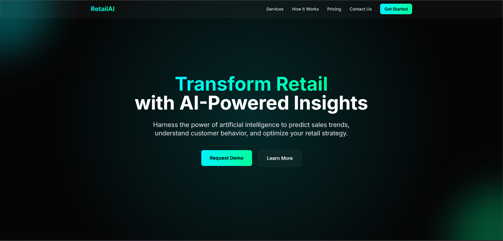
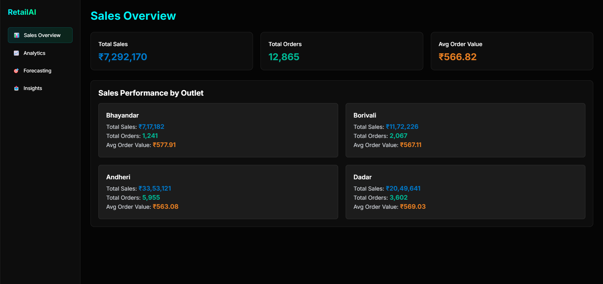
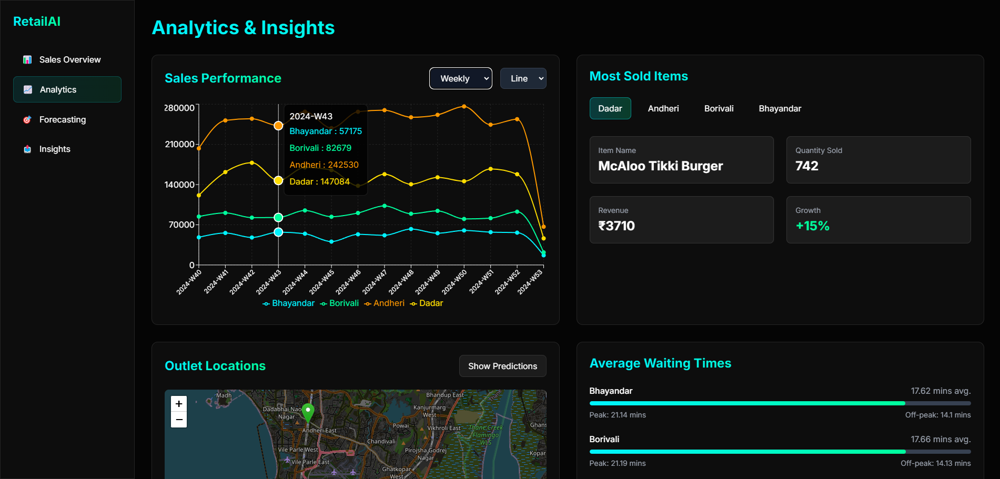
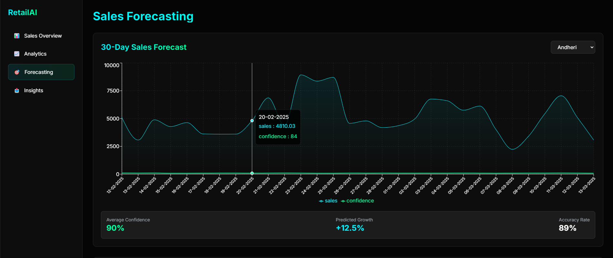
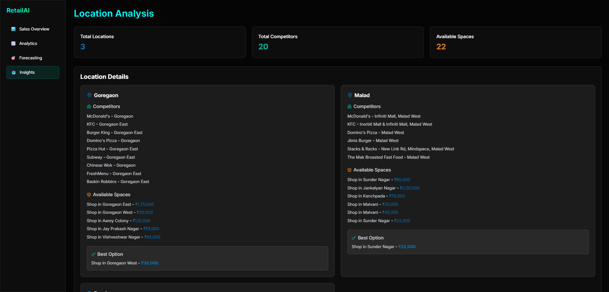

# RetailAI

RetailAI is an AI-powered retail analytics platform that provides valuable insights into outlet sales, performance, demand forecasting, and expansion strategies. The system integrates sales analytics, predictive modeling, and competitor analysis to help businesses optimize their retail locations and marketing strategies.

## 🚀 Features

### 📊 Dashboard
- View overall outlet sales, order count, and average order value.
- Monitor sales performance trends for better decision-making.

### 📈 Analytics
- Track outlet-wise sales performance on a weekly, monthly, quarterly, and yearly basis.
- Identify the most sold items per outlet, along with their order count and revenue.
- Analyze customer purchase behavior and sales distribution.

### 🗺️ Location Prediction & Expansion
- Visualize existing and predicted outlet locations on an interactive map.
- Identify demand levels (High, Medium) and waiting times for each location.
- Predict new outlet locations based on sales trends and customer demand.
- Compare competitor locations and available rental properties near predicted outlets.
- Recommend the best rental shop for expansion.

### 📅 30-Day Sales Forecast
- Use machine learning to generate 30-day sales predictions for each outlet.
- Optimize inventory and resource planning based on demand forecasts.

### 📢 WhatsApp Marketing Integration
- Send automated WhatsApp messages to customers when a new outlet opens.
- Leverage existing customer data for targeted marketing campaigns.

## 🛠️ Tech Stack
- **Frontend:** Next.js
- **Backend:** FastAPI
- **Machine Learning:** XGBoost for sales forecasting
- **Mapping & Visualization:** Leaflet.js for interactive maps
- **Messaging:** Twilio API for WhatsApp marketing

## 🚀 Deployment

The RetailAI project is deployed and fully operational.

The entire project (frontend + backend) is deployed and accessible at [your-deployed-project-link](https://retailai.vercel.app/). The frontend is hosted on [Vercel](https://vercel.com), and the backend is hosted on [Render](https://render.com).

Please note that since both frontend and backend are hosted on free-tier services, there may be occasional delays in response time or website functionality due to the limitations of these services. This may be more noticeable during peak usage times.

Both services offer scalable solutions, and upgrading to paid plans can ensure improved performance and reliability.

### Local Deployment
1. Clone the repository:
   ```bash
   git clone https://github.com/yourusername/RetailAI.git
   cd RetailAI
   ```
2. Install dependencies:
   ```bash
   # Backend (FastAPI)
   cd backend
   pip install -r requirements.txt
   ```
   ```bash
   # Frontend (Next.js)
   cd frontend
   npm install
   ```
3. Run the backend server:
   ```bash
   uvicorn main:app --reload
   ```
4. Run the frontend application:
   ```bash
   npm run dev
   ```

## 🔑 Login Information

To access the RetailAI dashboard, use the following credentials:

- **Email**: `test@gmail.com`
- **Password**: `pass@123`

This will grant you access to the dashboard and all available features.

---

## 📌 Usage
- Access the dashboard to monitor sales and orders.
- Navigate to analytics to view detailed outlet-wise performance.
- Use the interactive map to explore existing and predicted outlet locations.
- Check 30-day sales forecasts for demand insights.
- Utilize WhatsApp marketing for customer engagement.

## 📷 Screenshots
### Landing Page


### Overall Sales Dashboard


### Detailed Analytics of Each Outlet


### Forecasting


### Competitors & Rentable Shops Analysis



## 📬 Contact
For any queries or collaboration opportunities, reach out at [saumyadesai521@gmail.com](mailto:saumyadesai521@gmail.com) or connect with me on my [LinkedIn profile](https://www.linkedin.com/in/saumya-desai-42757328a).